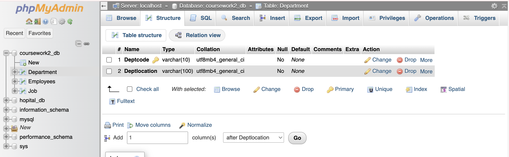
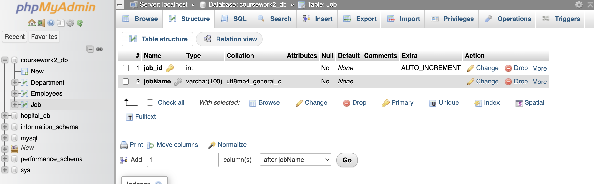
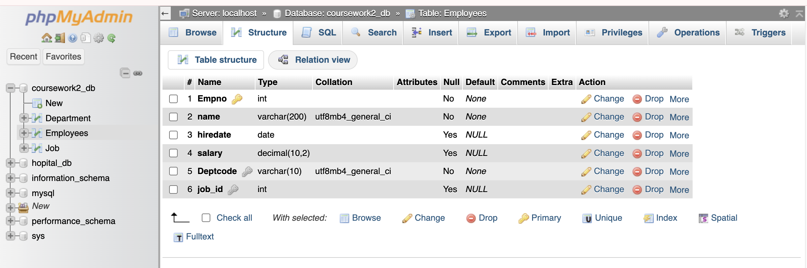

Coursework 2 – Normalization & SQL Queries

<Part 1 – Normalization up to 3NF>

1. Raw Dataset

    - Empno (1001,1002, ...) /int
    - Deptcode (3D, 1C, ...) /chard
    - Deptlocation (Lilla Edet, Sidokumpul, ...) /barchard
    - Name (Benjamin Minquet, Biddy Coppock, ...) /barchard
    - Job (Programmer IV, Heath Coach, ...) /barchard
    - hiredate (2019-10-25) /date
    - salary (133308.91) /int

2. Document the Normalization Process (up to 3NF)

    1) Cadidate Key => Empno
    2) Empno -> Name, Deptcode, Job, hiredate, salary
       Deptcode -> Deptlocation
    3) Deptcode is not a candidate key -> relation is not well formed 

        1NF: There's no repeating group. All attributes contain atomic values.
        2NF: There's no partial dependencies. Candidate key is a single attribute (Empno).
        3NF: Empno → Deptcode -> Deptlocation

             (1-1) Create Department Relation -> Department (Deptcode(P), Deptlocation)
             (1-2) Create Job Relation -> Job (job_id(P), jobName ) * i add job_id , because usaully i got more than two jobs in company..
             (1-3) Create Employees Relation -> Employees (Empno(P), Name, hiredate, salary, Deptcode(F), job_id(F))
             (1-4) Employees.Deptcode -> Department.Deptcode
                  Employees.job_id -> Job.job_id
        Results
            Employees => (Empno(P), Name, Job, hiredate, salary, Deptcode(F), job_id(F) )
            Department => (Department (Deptcode(P), Deptlocation))
            Job => (job_id(P), jobName)

<Part 2 – Schema Design & Table Creation> Screenshot img

